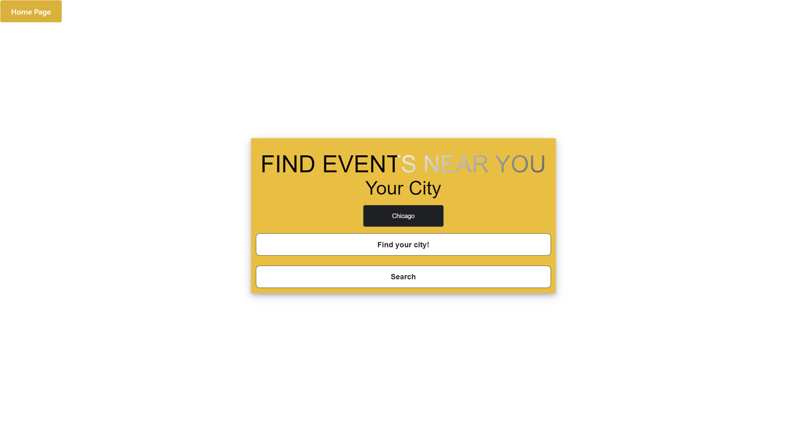

# Event-Locator-Tool

## User Story
A quarter into our Coding Bootcamp course, our knowledge is put to the test in creating our own application. As our first group project, we wanted to create an app that generated events happening within your city. The application itself will access your current address and filter the events within city range. As someone who doesn't have anything to do on the weekend, I want to be able to see local events based on my location so I can find events that are near me with ease.

## Acceptance Criteria
The following is the criteria that must be met: 

* Use a CSS framework other than Bootstrap.
* Be deployed to GitHub Pages.
* Be interactive (i.e: accept and respond to user input).
* Use at least two server-side APIs.
* Does not use alerts, confirms, or prompts (use modals).
* Use client-side storage to store persistent data.
* Be responsive.
* Have a polished UI.
* Have a clean repository that meets quality coding standards (file structure, naming conventions, follows best practices for class/id-naming conventions, indentation, quality comments, etc.).
* Have a quality README (with unique name, description, technologies used, screenshot, and link to deployed application).
Finally, You must add your project to the portfolio that you created in Module 2.

## Assets
Th main functionality of our application is to display events. To achieve this, we utilised the [Ticketmaster API](https://developer.ticketmaster.com/products-and-docs/apis/getting-started/). One of the Challenges that we faced was working with an API key (access key). We used Javascript and Jquery hand in hand to work around that obsticle. In order to grap the users location, we used [IP Geolocation API](https://ip-api.com/) and incorperate it with the ticketmaster API to filter the event search by city. The styling of the app was done with [Foundations Framework](https://get.foundation/sites/docs/).

Below are some images of the application:

Here is the link to the application:
https://info-hazard.github.io/Event-Locator-Tool/

## License
Permission is hereby granted, free of charge, to any person obtaining a copy of this software and associated documentation files (the "Software"), to deal in the Software without restriction, including without limitation the rights to use, copy, modify, merge, publish, distribute, sublicense, and/or sell copies of the Software, and to permit persons to whom the Software is furnished to do so, subject to the following conditions:  
    
The above copyright notice and this permission notice shall be included in all copies or substantial portions of the Software. 
    
THE SOFTWARE IS PROVIDED "AS IS", WITHOUT WARRANTY OF ANY KIND, EXPRESS OR IMPLIED, INCLUDING BUT NOT LIMITED TO THE WARRANTIES OF MERCHANTABILITY, FITNESS FOR A PARTICULAR PURPOSE AND NONINFRINGEMENT. IN NO EVENT SHALL THE AUTHORS OR COPYRIGHT HOLDERS BE LIABLE FOR ANY CLAIM, DAMAGES OR OTHER LIABILITY, WHETHER IN AN ACTION OF CONTRACT, TORT OR OTHERWISE, ARISING FROM, OUT OF OR IN CONNECTION WITH THE SOFTWARE OR THE USE OR OTHER DEALINGS IN THE SOFTWARE
